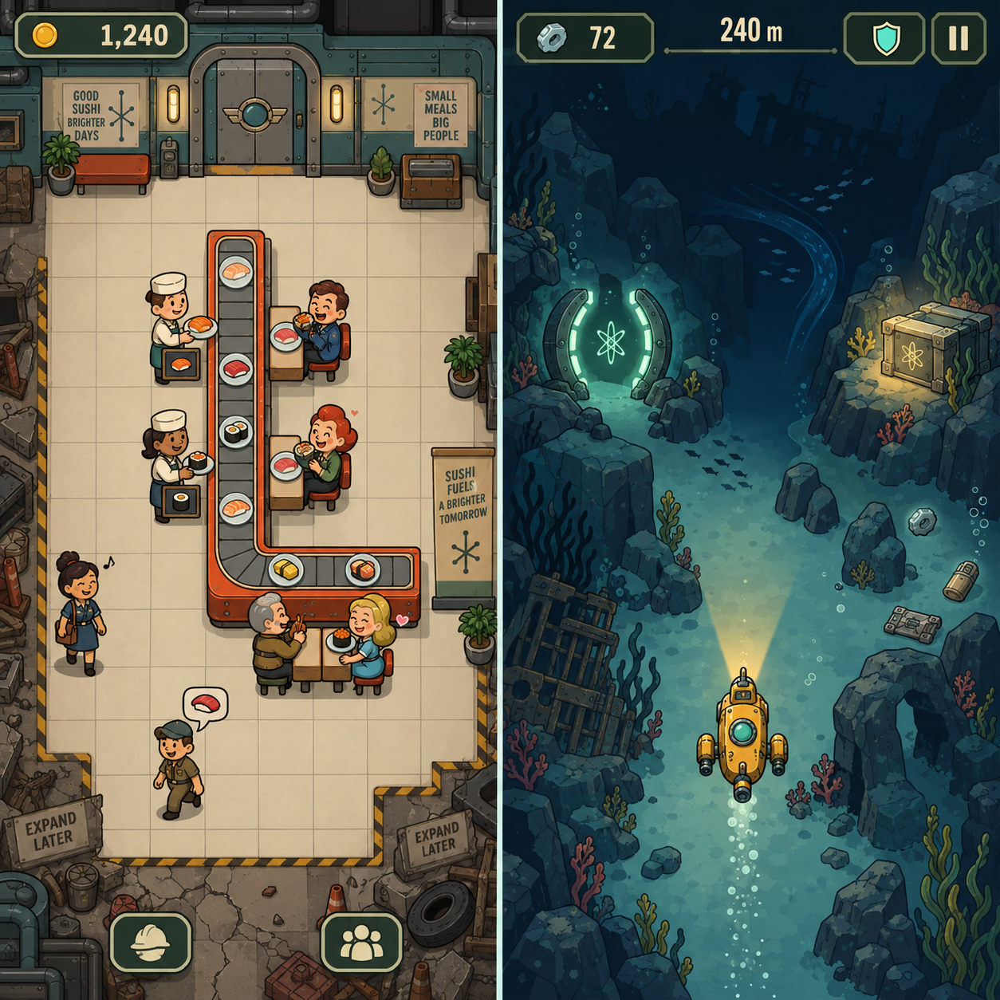
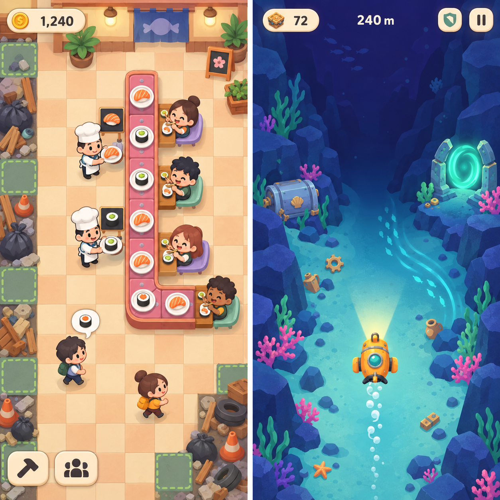

# Paired art-direction studies

Generated with the built-in image generation tool. Each image pairs a restaurant screen (left) and an expedition screen (right). These are static art studies, not production sprite sheets or authoritative gameplay layouts. The user selected **01-doodle.png** as the art direction for both modes; see [the accepted style guide](../../docs/art-direction.md). The other studies remain alternatives.

## Shared prompt

Use case: ui-mockup. Create a finished commercial 2D mobile game art-direction comparison, TWO equally sized portrait gameplay screens side by side in a near-square image with only a thin separator, no device frames, no marketing poster, no explanatory annotations. LEFT screen is a conveyor sushi restaurant, RIGHT screen is its underwater submarine expedition. Both screens must feel like two modes of the SAME game with consistent sprite outlines, icon design, palette, and interface materials. Preserve crisp readable game sprites and believable modular animation-friendly character shapes; not cinematic concept art. LEFT: straight-on top-down orthographic square-grid floor, subtle visible grid, all seats, chefs and belt segments occupy exactly ONE square cell each with no overlapping cells. A compact open L-shaped conveyor made of separate square tiles runs downward through the center and then turns right; sushi plates on it. Two cute chef sprites stand on separate floor cells beside the vertical belt, NEVER on the belt or at its endpoint, loading sushi sideways; a tiny recipe blackboard fits within each chef's own cell. Four seated customers occupy seats along the outside of the belt, each facing its adjacent belt tile, with clear happy/eating poses. Two walking patrons on open floor, one with a small sushi preference bubble. Include a limited clean rectangular usable floor, surrounding expansion patches of garbage along far sides. Maintain room to read belt routes, no excessive kitchen props. Slim top HUD coin icon and '1,240', compact icon-only edit and staff controls near bottom, no earning rate, no progress bars over every person. RIGHT: full-screen ocean-bed environment with NO footer, NO buttons, NO joystick, NO weapon or torpedo, NO reward preview. Overhead view of a small charming submarine near the lower third, nose points UP, bubbly wake DOWN, headlight shines UP. It travels forward into a descending seabed canyon: lower screen lighter, upper screen progressively darker deep water, no surface or horizon. Freeform navigable space, NO lanes or grid. Several solid rocks and a gentle curved side current ahead; a luminous paired portal and sealed salvage cache off to the sides, sparse collectible salvage pieces. Clear navigable routes, uncluttered upper lookahead area. Minimal top HUD salvage icon and '72', '240 m', small shield and pause icons. Both scenes should fill their respective screens. No game title, no brand logo, no watermarks. High polish and careful small-screen visual hierarchy.

## 01-doodle.png

The shared prompt above was followed by:

ART DIRECTION 1: PREMIUM DOODLE. Playful hand-inked drawing, confidently irregular black outlines, simplified rounded expressive character sprites, flat fills with restrained colored-pencil grain and sparse hand-drawn hatching. Restaurant warm ivory paper floor, coral red conveyor accents, mustard yellow sushi and submarine, mint green details. Ocean uses layered navy and teal ink fills while keeping paper-and-ink style, off-white linework and warm yellow headlight. Doodle should mean beautifully art-directed commercial indie mobile game, NOT crude sketch, placeholder wireframe, messy notebook or low-quality prototype. HUD coins, shield, pause and bottom restaurant tools feel like expertly drawn sticker icons, crisp legible numerals. Texture quiet enough to preserve hazard visibility. Natural charm through line shape and expressive sprites, not dense decoration.

## 02-retro-atomic.png

The shared prompt above was followed by:

ART DIRECTION 2: RETRO ATOMIC BUNKER, inspired by Fallout Shelter's readable flat 2D cartoon sprites and mid-century atomic-age design language, but original sushi restaurant and submarine, no Fallout logos, vault numbers, franchise characters or branding. The difference from doodle should be unmistakable: exceptionally clean digitally inked contours, flat graphic shapes, restrained two-tone cel shading, angular retro furniture, 1950s silhouettes and geometric interface framing, NO paper grain, watercolor or painterly rendering. Restaurant is a cheerful utilitarian underground diner with cream tiled floor, warm orange/red conveyor housing, muted teal riveted wall trim, art-deco rounded steel door, chrome details, original expressive tiny diner customers in retro workwear, chefs in cream caps and muted-teal aprons. Still the same top-down gridded L conveyor and one-cell people, NOT the side-on stacked-room view of Fallout Shelter. Recipe blackboards are tiny signs attached to chef apron or integrated in their own cell, not an additional adjacent cell. Expansion trash is rusted scrap and cracked floor outside clear rectangle. Submarine mustard-yellow industrial rounded shell with chunky mechanical fins and teal porthole, overhead nose pointing UP, trail below. Ocean navy/olive teal limited palette, readable geometric rock shapes, stylized metal salvage and a circular retro-tech portal, upper abyss dark, warm amber headlight. UI thin olive-green instrument frames, cream condensed retro numerals, industrial but elegant mint shield and pause symbols. Minimal HUD, no giant gauges, no CRT screen overlay hiding action. Overall finished premium playable 2D mobile game screenshot, not photorealistic, not dark gritty realism, not promotional poster; strong friendly character animation-ready silhouettes and excellent small-screen clarity.

## 03-storybook.png

The shared prompt above was followed by:

ART DIRECTION 3: BRIGHT STORYBOOK CUT-PAPER 2D. Make this strikingly different from doodle and retro industrial: vibrant clean layered paper shapes, soft rounded geometry, extremely restrained subtle grain, minimal contour lines rather than heavy black ink, gentle graphic contact shadows, luminous cheerful color blocks. Polished playful mobile game with a sophisticated picture-book sensibility, NOT realistic, not 3D, not painted concept art, not rough collage, no photoreal paper textures. Restaurant warm peach and buttercream square floor tiles, coral-pink modular conveyor edges, lavender and mint seat colors, tiny appealing stylized chibi chef and patron sprites with round heads, small bodies, expressive readable eyes; simplify people into clean reusable animation-friendly body parts. A small dish sign on each chef's apron fits within their same single grid cell. Original sushi plates are beautifully readable cream-white circles with orange salmon and emerald cucumber. Garbage expansion patches small tidy stylized paper-cut bundles near far sides. Cute simple geometric UI coins and buttons in warm cream pill shapes. Underwater scene deep violet-to-ultramarine abyss ahead, luminous turquoise nearer seabed, rock formations built from large smooth layered silhouettes with generous clear water between; small coral clusters magenta and seafoam around margins. Submarine warm tangerine with turquoise window, toy-like but flat 2D overhead sprite, nose toward TOP, headlights up and bubble trail down. Soft luminous mint portal, similarly styled still-sealed cache, small distinct pale-copper salvage pieces, lateral current represented by elegant turquoise curved streaks. Upper view remains uncluttered for steering. Minimal slim top HUD, no controls or footer anywhere on expedition scene. Shape language shared across both screens, a high-quality lively commercial interface, exquisite palette and readability over detail. Do not add decorative slogans, textual signs, or any lettering except specified HUD numbers. Keep the two complete playable screen compositions comparable to the other variations.
