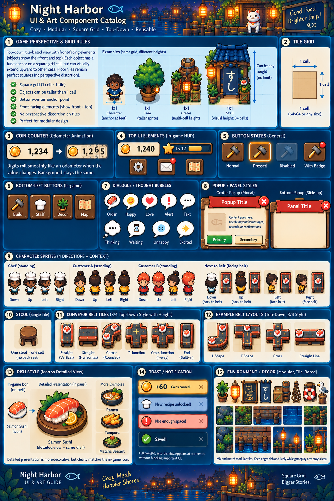

# Selected art direction: doodle

Status: accepted by the user. Applies to both the sushi restaurant and submarine expedition.

## Visual reference

Follow this supplied catalog for the finished UI and game artwork. It is available in the wireframe's [Doodle UI & art catalog concept page](https://game-prototypes-yiochen.netlify.app/prototypes/sushi-loop/?ntl-drawer-state=hidden#concept-doodle-catalog), with zoom and access to the full original. Apply its materials, silhouettes, sprites, icons, dishes, bubbles and modular environment treatment to the [current wireframe composition and controls](https://game-prototypes-yiochen.netlify.app/prototypes/sushi-loop/?ntl-drawer-state=hidden#floor-plan).

The catalog's Night Harbor name, sample numbers, Settings/Map/global level controls and T/cross belt artwork are examples, not new game requirements. Keep the selected wireframe's control set, transparent restaurant HUD, curled Shop/Workshop paper pages and accepted one-input/one-output belts. Square-cell occupancy, production rules and progression remain governed by the spec. The catalog is a visual reference, not a production sprite sheet; assets must be authored separately.

The earlier [paired restaurant/expedition study](../design/art-directions/01-doodle.png) remains historical visual exploration. The new component catalog is the primary art reference.

## Style guide

- Confident, slightly irregular ink outlines with rounded, readable silhouettes.
- Simple expressive faces and modular character shapes suited to 2D animation. Customer reactions should read at phone size.
- Rich readable color, dimensional shading, warm wood/parchment materials, and restrained texture as shown in the catalog. Keep texture quieter than characters, sushi, pickups, and hazards.
- Restaurant: warm wood, ivory/parchment and lantern accents against harbor navy/teal, with vivid food and character colors.
- Expedition: deep navy and teal water, warm yellow submarine and headlight, and bright accents for interactive objects.
- Both modes share the catalog's line treatment, shape language and hand-drawn icons. Preserve the wireframe's transparent restaurant HUD without an added cream/yellow backing container; use material surfaces where the selected component calls for them.
- Keep square floor cells undistorted and sprite bases anchored at bottom-center. Taller front/top-facing artwork can extend above its occupied footprint; the catalog's 64px tile example does not set production pixel size.
- Match dish icons on belts to their more detailed panel illustrations. Reuse the catalog's normal/pressed/disabled/badge visual states and expressive thought bubbles within the selected control set.
- Commercial finish comes from consistent outlines, deliberate spacing, polished icons, and clear visual hierarchy.

## Gameplay presentation

Use locked portrait orientation throughout the game, including the sushi bar, expedition, Workshop, and related screens. Rotating the device does not reflow the game into landscape. Exact phone insets and sizes remain to be designed.

The restaurant retains its square grid, with each chef, seat, and belt tile fitting its own cell. Recipe blackboards belong within the chef's footprint. NPC reactions and belt dishes remain easy to distinguish from floor decoration.

Use the current large portrait recipe dialog over a light restaurant scrim for the selected chef, with a scrolling two-column grid of recipe tiles in the upper area and a fixed recipe details panel below. On opening, the panel shows this chef's current recipe. Keep this ordering without visible section headings: cookable recipes from highest to lowest tier, discovered recipes above this chef's tier from highest to lowest in muted color, then undiscovered recipes as silhouettes engraved on their tier-material boards. The named tiers are Wood, Steel, Copper, Silver, and Gold. Render each recipe tile as a board made from its tier's material, using distinct color and texture rather than relying on a text label. Show discovered dishes as full-color illustrations with their names and fixed coin selling prices against their board, without visible tier labels; keep undiscovered dishes as engraved silhouettes. Mark newly unlocked recipes with a small NEW badge until inspected in the restaurant. Outline the current-recipe tile and give the tile selected for inspection a different outline; keep both outlines distinguishable if they apply to the same tile. Keep these outlines visually distinct from NEW. Tapping a discovered tile updates the lower panel with its artwork, price, effective preparation time and required chef level; the board material conveys tier with an accessible description. When it shows the chef's current recipe, display a noninteractive Preparing status in place of Prepare; selecting a different eligible recipe restores Prepare. Include both an icon-only header close control and support the phone's system back gesture; either closes the picker without changing the chef's current recipe or cooking state. The panel stays in place while tiles scroll. Choosing a different recipe closes the picker to show live service; briefly shake the updated chef blackboard to signal the recipe change. Keep this motion local to the blackboard within the chef's cell. For cookable recipes, show only the preparation duration adjusted for this chef's current speed, omitting base time. Discovered recipes above the selected chef's tier stay inspectable with their required material board and level; disable Prepare and show a dash (—) for preparation time while the chef is ineligible. Keep the NEW marker legible alongside tile artwork; tier thresholds and material details, card/panel dimensions and artwork/insets, and blackboard-shake timing/amplitude remain to be designed.

At the restaurant dock, show charge through a scene-local battery indicator. When the battery is full, keep it visibly full and gently pulse the submarine's headlight to signal readiness. Keep this cue within the dock scene, without a separate HUD ready badge. The current wireframe shows a compact Ready/Charging state beside its local battery. Tapping the charging submarine shows a brief local message with Charging and the time remaining until full. Keep time remaining on demand rather than in a persistent HUD timer. Exact headlight colors, animation timing, and charging-message wording/duration remain to be designed.

Shop and Workshop use the same paper-page surface over the actual restaurant, with a curled upper-right corner revealing the floor and acting as the return control. Returning preserves exact camera position, Live/Edit mode and tray state and restores focus to the opener without scrolling. Apply the catalog's material finish to this selected paper composition. The physical Workshop hut remains to the submarine's right within their shared 3 × 3 floor-cell footprint; its taller art must not cover the ship. The preparation screen retains its Sushi Bar airlock, and preparation/results returns recenter the starter restaurant floor.

The expedition shows an overhead submarine traveling up the screen along a descending ocean-bed canyon. The scene fills the screen, with drag steering and a compact top HUD overlay. Its status row places the hull meter upper-left, collected expedition salvage as an icon and amount in the center, and pause upper-right. The creature's name and boss-style resistance bar occupy a separate wide row below while ship status stays in place. The bar appears full when the shooting window opens, stays full during aiming, and drains toward capture after hooking while following within range. A contextual harpoon button overlays the lower-right corner during the shooting window. During cooldown, mute its icon and fill a circular recharge ring around the button, restoring its active appearance when ready; keep the feedback within the button without a numeric timer. Pursuit shows a faint narrow vertical following strip tracking the creature's horizontal position, without visible top or bottom boundaries. Upcoming encounters occupy the visible space above the submarine. Coins belong to the restaurant economy; salvage belongs to the expedition economy.

Before an unhooked creature's shooting window expires, show a clearly restless animation, such as quicker fin movements and extra bubbles, then let it swim away at expiry. The warning does not change its movement path or hit area. Convey the approaching escape through the creature's behavior, without a shooting-window HUD countdown. Exact warning duration and species-specific animation remain to be designed.

Confine the low-hull warning to the existing upper-left hull meter, using a warning color and gentle pulse while hull is low. Add no screen-edge tint. Exact threshold, colors, pulse timing, and intensity remain to be designed.

Celebrate a successful catch with a full-screen portrait cutscene in the selected 2D doodle style. Keep it very quick, lasting only a few seconds, and play it automatically without a Skip button. Open the award dialog automatically afterward. Active gameplay and hazards have ended during this presentation. The composition, animation, and exact timing within the short-duration target remain to be designed.

Expedition results present a salvage receipt with pickups, a repeat-catch bonus when earned, and a completion bonus, followed by a prominent total earned. Show a zero completion bonus with a short explanation on failure or early return. Keep the single Restaurant continuation. The dedicated first-catch recipe award shows artwork, price and base preparation time on the required material board (copper for the Eel fixture), with accessible tier information and no separate Chef requirement row; the following results omit a recipe recap. Use the outcome titles Expedition complete, Returned early, and Hull depleted, each with a different image-generated background in the selected 2D doodle style. Keep the receipt and action visually consistent across outcomes. Backgrounds are presentation rather than additional repair, rescue, permanent-damage, or lost-reward mechanics. Exact receipt/background styling remains to be designed.

Generated background studies within result-screen mockups: [bright completed-route water](../design/ui/41a-results-complete.png), [quiet return corridor](../design/ui/41b-results-returned-early.png), and [damaged submarine in a rocky alcove](../design/ui/41c-results-hull-depleted.png). These illustrate the accepted distinct-background approach; their exact composition and example amounts remain proposals. [Exact prompts and output record](../design/ui/41-results-background-prompts.md) document the built-in generation. Each is a static portrait mockup with baked-in UI rather than an isolated background or animated cutscene.

At a few selected equipment levels, show visible hull-panel, harpoon, or collector improvements on the submarine. The same equipment appearance persists in the Workshop, dock, and expedition. Preserve the recognizable yellow silhouette, existing ship footprint, and collision size. These changes reflect the accepted equipment stats without adding mechanics. Exact thresholds and part artwork remain to be designed; existing references do not depict every equipment level.

## Source and alternatives

The current catalog was supplied by the user as `design/art-directions/doodle.png` and is displayed unchanged in the concept page. The earlier paired study was generated with the built-in image generation tool; its prompts are recorded in [the generation record](../design/art-directions/prompts.md).

Retro atomic and bright storybook were earlier alternatives. The supplied doodle catalog is the selected direction for future work.
